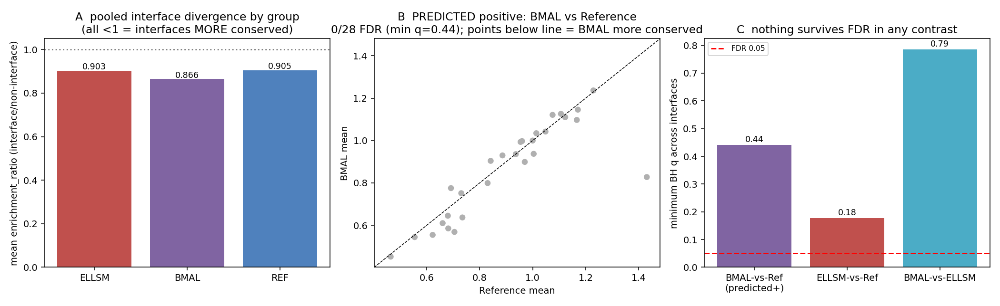

# Cell-cycle panel — BMAL-predicted convergent-divergent contrast (the last unverified arm)

Date: 2026-07-29
Candidate set: `cell_cycle`
Status: **technical checkpoint / preliminary result — not a validated biological claim.**
Companion to `../2026-07-28-sirt6-convergent-divergent-stratified/` and
`../2026-07-28-ampk-convergent-divergent-stratified/` (same BMAL / ELLSM / Reference design).

## Why this is the test

The convergent-divergent model makes one prediction this project had **not** yet tested: that
**large-bodied long-lived mammals (BMAL)** show *intensified* interface divergence in
**cell-cycle / tumor-suppressor control** (Peto's paradox / cancer resistance). SIRT6 tested the
ELLSM→DNA-repair arm (null); AMPK was the energy-sensing control (null). **BMAL-vs-Reference on a
cell-cycle panel is the contrast where a positive is predicted.** This run closes that arm.

## Design

- New candidate set `cell_cycle` (`data/config/candidate_sets.yaml`): CDKs (1/2/4/6), cyclins
  (A/B/D/E), CDK inhibitors (p16/CDKN2A, p21, p27), MDM2/4, ATM/ATR, CHEK1/2, WEE1, CDC25A/C,
  spindle checkpoint (CDC20, BUB1B, MAD2L1), APC/C (CDC27, FZR1, ANAPC2).
- Selected with the new `select --selection-mode explicit_only` flag (partner-aware mode pulled in
  off-target AMPK/histone/chromatin complexes and was rejected). 20 complexes selected; **15
  yielded a usable 8 Å interface** (5 dropped on PDB chain-mapping in the interface stage:
  HSP90–CDK4, CDK4–CDC37, two APC/C subunit pairs, CDC20–MAD2). → **30 interfaces** (receptor +
  ligand) across 22 species + human anchor.
- Per-residue ESM C (`esmc-300m-2024-12`) embeddings; interface = 8 Å inter-chain contacts;
  `enrichment_ratio` = mean interface delta / mean non-interface delta per species-vs-human.
- Strata: ELLSM 5 (naked/Damaraland/blind mole-rat, *Myotis*, greater horseshoe bat), BMAL 5
  (elephant, blue whale, beluga, sperm whale, white rhino), Reference 12.

## Results — the predicted positive does not appear

| Contrast | interfaces | min p | min BH q | q<0.05 | top interface (direction) |
|---|---:|---:|---:|:---:|---|
| **BMAL vs Reference** (predicted +) | 28 | 0.049 | 0.44 | **0** | CDK2–CyclinA1 lig — **Reference-ward** |
| ELLSM vs Reference | 29 | 0.006 | 0.18 | **0** | CDC20–BUB1B rec — Reference-ward |
| BMAL vs ELLSM | 28 | 0.032 | 0.79 | **0** | CDK2–p27 rec — ELLSM-ward |

**BMAL-vs-Reference on the cell-cycle panel is null: 0 / 28 interfaces survive FDR**, and the
nominal signal runs the *wrong way* — the lowest-p interfaces are **Reference-ward** (BMAL interfaces
are *more* conserved than reference, not more divergent). The convergent-divergent prediction is not
merely unsupported; its direction is inverted.

Pooled group-mean `enrichment_ratio`: ELLSM 0.903, **BMAL 0.866**, Reference 0.905 — all **below 1**,
with BMAL the lowest. Below-1 means the cell-cycle interfaces are *more conserved than the rest of
each protein*, exactly as expected for essential CDK–cyclin and checkpoint contacts under strong
purifying selection. The method is behaving correctly; there is simply no lineage-specific
divergence to find.

## Specificity controls

Mean `enrichment_ratio` 0.896 vs **shuffled-mask 1.004** and **NEGATOME 1.225**; only **33 %** of
rows have interface divergence exceeding their own shuffled control. So the interface signal is, if
anything, *lower* than the shuffled and universal-partner baselines — the opposite of a specific
interface-localized adaptive signal.

## Interpretation

The last unverified arm of the convergent-divergent model behaves like the other two: **robust
negative**. Two pathways predicted to carry lineage-specific longevity signal on the ESM interface
metric — ELLSM→DNA-repair (SIRT6) and now BMAL→cell-cycle — are both null under FDR, and the
cell-cycle interfaces are under stronger-than-average purifying selection rather than intensified
divergence. Across three pathways × the stratified design × three controls, the ESM
interface-divergence method returns no FDR-surviving, convergent longevity signal. This closes the
model test.

## Caveats / boundaries

- 5 of 20 selected complexes dropped on PDB chain-mapping in the interface stage (no 8 Å interface
  extracted); the 15 analyzed still span CDK–cyclin (CDK1/2/4/6 × cyclin A/B/D/E), CDK–inhibitor
  (CDK6–p16, CDK2–p27) and spindle-checkpoint (CDC20–BUB1B, MAD1–MAD2) interfaces.
- CDKN2A/p16 has weak BMAL ortholog coverage (2 species); the p16-side contrast is underpowered.
- Same method-boundary as the companion runs: ESM-L2 interface divergence is not a lineage-specific
  selection detector (see `../2026-07-29-ku80-interface-dnds-orthogonal/`).

## Provenance

- Setup: `cell_cycle` set in `data/config/candidate_sets.yaml`; `select --selection-mode` flag added
  in `src/longevity_port_pipelines/cli.py`; parquet-write schema fix in
  `src/longevity_port_pipelines/pipeline.py` (`infer_schema_length=None`).
- Pipeline: `uv run select --candidate-set cell_cycle --count 20 --selection-mode explicit_only`
  → `orthologs` → `embed` → `analyze` → `data/output/enrichment.parquet` (615 rows).
- Contrasts: `scripts/analyze_cell_cycle_contrasts.py` → `cell_cycle_contrasts.json`,
  `cell_cycle_contrasts.png` (committed here). `data/` intermediates are gitignored and regenerable.
