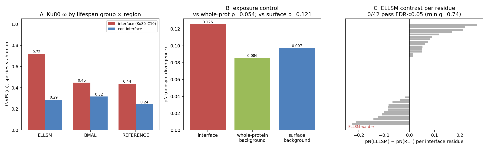

# Ku80 / 8AG5 interface — orthogonal dN/dS test of the recurring crumb

Date: 2026-07-29
Candidate: Ku80 (XRCC5, human `P13010`) interface in PDB `8AG5`
Status: **technical checkpoint / preliminary result — not a validated biological claim.**
Follow-up to the SIRT6/AMPK stratified embedding contrasts
(`../2026-07-28-sirt6-convergent-divergent-stratified/`,
`../2026-07-28-ampk-convergent-divergent-stratified/`).

## Why this test

Across two pathways × two designs × three controls, the ESM interface-divergence method returned a
stable negative. The single signal that recurred was **Ku80 / 8AG5**: stably ELLSM-ward at the
nominal level on the ESM C L2 metric, but never surviving BH-FDR and never showing clean
cross-lineage convergence. The inference was that *L2 divergence of ESM embeddings ≠ lineage-specific
selection*. This lane tests that inference directly with an **orthogonal metric that measures
selection itself — site-level dN/dS (Nei–Gojobori)** — on the same interface and the same strata.

Note on the structure: in `8AG5`, chain **B = Ku80 (P13010)**, chains **C/D = vaccinia-virus C10
(P03296)**, an immune-evasion antagonist of the Ku heterodimer (chain A = Ku70). The "interface"
tested is therefore Ku80's **host–virus contact surface** — a priori one of the more plausible places
in the protein to find diversifying selection, which makes it a fair test for the crumb.

## Design

Same strata as the stratified embedding runs (all covered here by CDS orthologs):

- **ELLSM (5):** naked mole-rat, Damaraland mole-rat, blind mole-rat, *Myotis lucifugus*, greater
  horseshoe bat.
- **BMAL (5):** African elephant, blue whale, beluga, sperm whale, white rhino.
- **Reference (12):** mouse, rat, hamster, guinea pig, rhesus, sheep, opossum, dog, mouse lemur,
  ground squirrel, hedgehog, cat — plus **human** as the pairwise anchor.

## Method

Coding (CDS) orthologs of XRCC5 were fetched per species from **NCBI Gene (ortholog by taxid)** and
verified by translation against the pipeline's stored ortholog proteins (k-mer containment; 23/23
recovered, strata 5 / 5 / 12 + human). Protein MSA (FAMSA) threaded back to a **codon alignment**
(867 columns; 732 "core" columns with ≥60 % occupancy and human non-gap). Interface residues =
Ku80 chain-B residues with any atom within **8 Å** of the vaccinia partner (chain D, matching the
pipeline's `B1–D1` definition): **43 residues → 42 core codon columns** (75 → 73 using both C/D
copies). Selection was measured as **Nei–Gojobori** synonymous/nonsynonymous divergence, pooled over
species-vs-human pairwise codon comparisons; ω = dN/dS (Jukes–Cantor corrected). Significance by
**permutation** (2000×) and **BH-FDR**, mirroring the project's nonparametric idiom. A **solvent-
exposure control** (Shrake–Rupley RSA on isolated Ku80) restricts the background to *surface*
non-interface residues.

## Results — no ELLSM-specific selection; interface elevation is a surface effect

ω (dN/dS), species-vs-human pooled:

| Group | interface ω | non-interface ω | interface pN | non-interface pN |
|---|---:|---:|---:|---:|
| ELLSM | 0.718 | 0.287 | 0.138 | 0.083 |
| BMAL | 0.448 | 0.317 | 0.114 | 0.082 |
| Reference | 0.437 | 0.243 | 0.125 | 0.089 |
| All long+ref | 0.490 | 0.267 | 0.126 | 0.086 |

Tests:

| Test | statistic | value | p | pass? |
|---|---|---:|---:|---|
| **T1** interface vs whole-protein (all species) | ω ratio | 1.83 | 0.054 | borderline |
| **T1b** interface vs **surface** non-interface | ω ratio | 1.56 | 0.121 | **no** |
| **T1b** (same) | pN ratio | 1.29 | — | — |
| **T2** ELLSM vs Reference at interface | ΔpN | +0.013 | 0.617 | **no** |
| **Per-residue** ELLSM-vs-Ref (42 interface cols) | q<0.05 | **0 / 42** | min q = 0.74 | **no** |

Three readings:

1. **The eye-catching ELLSM interface ω = 0.72 is a denominator artifact.** It is driven by a *low
   synonymous* rate at those columns (pS = 0.185) with few ELLSM species, not by elevated
   nonsynonymous change: pN_ELLSM = 0.138 is barely above pN_Ref = 0.125. The robust pN-based tests
   see no ELLSM enrichment (T2 p = 0.62).

2. **The whole-interface elevation is not virus-specific.** The interface is ~1.8× the whole-protein
   background (p ≈ 0.05), but against a **surface-matched** background it falls to 1.56× (p = 0.12).
   Most of the elevation reflects the interface simply being solvent-exposed, not host–virus
   diversifying selection.

3. **The crumb reproduces — and dies at FDR, exactly as on ESM.** Individual interface residues
   246 (p = 0.021), 262 (0.039) and 368 (0.053) are nominally ELLSM-ward, but **0 / 42 survive
   FDR** (min q = 0.74). The Ku80 interface is nominally long-ward on *both* an embedding metric and a
   selection metric, and survives FDR on neither.

## Interpretation

An orthogonal method that directly measures selection (dN/dS) **confirms** the embedding-era
conclusion: the Ku80 / 8AG5 crumb is a stable nominal ELLSM-ward blip that does not correspond to
lineage-specific selection and does not survive multiple testing. The convergence of two independent
metrics on the *same* sub-FDR verdict tightens the project's overall negative rather than opening a
positive. It also refines the method-boundary statement: the interface's mild dN/dS elevation is
explained by solvent exposure, so the ESM-L2 "interface > non-interface" contrast likely tracks the
same generic surface tolerance rather than adaptive divergence.

## Caveats / boundaries

- **Counting-based** Nei–Gojobori, not maximum-likelihood. A codeml/HyPhy branch-site model on the
  ELLSM foreground would be the confirmatory step; the pN-level null here makes a positive there
  unlikely but not impossible.
- Pairwise **vs-human** anchoring folds divergence-time differences into ω; ratios are relatively
  time-robust but not immune.
- ELLSM n = 5 limits per-residue power (as everywhere in this project).
- Ku80's C-terminal region is unresolved in `8AG5` (chain B spans ~1–544), so the interface mask is
  restricted to the resolved region.

## Provenance

- CDS fetch: `scripts/fetch_ku80_cds.py` → `data/interim/ku80/ku80_cds.fasta`,
  `ku80_cds_coverage.tsv` (23/23 OK).
- Analysis: `scripts/analyze_ku80_dnds.py` → `ku80_codon_alignment.fasta`,
  `ku80_dnds_results.json`, `ku80_dnds_by_column.tsv`.
- Committed copies of the machine-readable outputs and the figure live in this directory
  (`ku80_dnds_results.json`, `ku80_dnds_by_column.tsv`, `ku80_cds_coverage.tsv`, `ku80_dnds.png`);
  the large intermediates under `data/interim/` are gitignored and regenerable from the two scripts.
- Interface: Ku80 chain B vs vaccinia C10 chain D, 8 Å, from `data/interim/pdb/8ag5.cif`.
