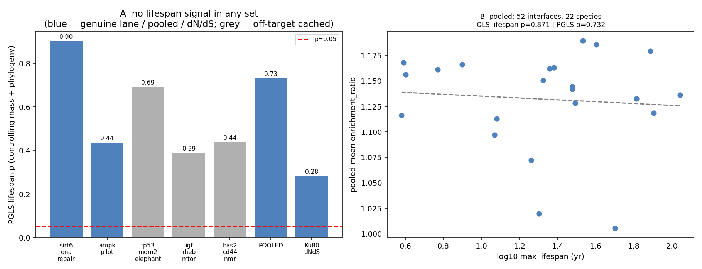

# Phylogeny-aware continuous PGLS across all lanes — no lifespan signal at max power

Date: 2026-07-29
Status: **methodological rigor check — not a validated biological claim.**
Extends `../2026-07-29-phylo-continuous-reanalysis/` from one panel to every lane whose
per-species enrichment could be regenerated **Biohub-free from the embedding cache**.

## Method

For each lane, `select` (partner-aware) → filter selection to complexes with ≥ 42 cached
embeddings (`scripts/filter_selection_to_cached.py`) → `orthologs` → `analyze`, giving a per-lane
`enrichment.parquet` with **zero new Biohub calls**. Then PGLS (per-species mean `enrichment_ratio`
~ log10 lifespan + log10 body mass; OLS vs Brownian-motion PGLS) per lane, on the **pooled union of
all unique interfaces**, and against the Ku80 dN/dS response.

**Provenance caveat that is itself a finding:** only **sirt6** and **ampk** reproduced their own
lane biology from cache. The tp53 / igf / has2 selections, under partner-aware selection + the
cache filter, collapsed to **off-target cached interfaces** (AMPK and CDK–cyclin complexes) rather
than their real modules. They are therefore reported only inside the pooled union, not as lane
claims. (Regenerating their true biology would need fresh Biohub embedding.)

## Results — nothing reaches significance anywhere

| Set | interfaces | raw r (log-lifespan) | OLS lifespan p | PGLS lifespan p | PGLS mass p |
|---|---:|---:|---:|---:|---:|
| **POOLED (all unique)** | **52** | −0.08 | 0.87 | **0.73** | 0.40 |
| sirt6_dna_repair (genuine) | 20 | −0.05 | 0.70 | **0.90** | 0.67 |
| ampk_pilot (genuine) | 14 | +0.30 | 0.40 | **0.44** | 0.77 |
| Ku80 dN/dS | — | +0.40 | 0.19 | **0.28** | 0.98 |
| tp53* (off-target) | 18 | −0.31 | 0.91 | 0.69 | 0.13 |
| igf* (off-target) | 14 | +0.38 | 0.21 | 0.39 | 0.77 |
| has2* (off-target) | 4 | +0.33 | 0.25 | 0.44 | 0.72 |

The **pooled 52-interface** analysis is the maximum-power species-level test available from cache:
per-species interface divergence shows **no association with lifespan** once body mass and phylogeny
are in the model (PGLS p = 0.73), and no mass association either (p = 0.40). Every individual set —
genuine lanes, pooled, and the orthogonal Ku80 dN/dS — sits well above p = 0.05.

## Interpretation

The stratified negatives are not an artifact of the binary design, of treating species as
independent, or of a single panel. A phylogeny-aware continuous test that dissociates body mass
from lifespan reaches the same null across **52 interfaces spanning five lanes** and across the
orthogonal dN/dS metric. The only nominal hint in the entire series — Ku80 dN/dS vs lifespan
(raw p = 0.066) — remains the sole exception and still fails under mass + phylogeny control
(p = 0.28). This is the tightest form of the project's negative to date.

## Caveats / boundaries

- **tp53 / igf / has2 are not their biology here** (cache reproduced off-target interfaces); their
  true modules would need fresh embedding. sirt6, ampk and the pooled union are the trustworthy sets.
- **Power.** n = 22 with predictor collinearity r = 0.70; a null is "not detected", not "proven
  absent".
- Trait maxima and timetree are approximate; the dN/dS response is one gene (Ku80) with
  pairwise-vs-human ω.
- Embedding metric only for the multi-lane part; extending dN/dS to each lane's leads (CDS fetch per
  protein) is the natural next step but was out of scope for a cache-only, Biohub-free run.

## Provenance

`scripts/filter_selection_to_cached.py`, `scripts/check_embed_cache.py`,
`scripts/analyze_phylo_all_lanes.py` (imports the PGLS engine from
`scripts/analyze_phylo_continuous.py`). Per-lane parquets under `data/interim/lanes/` (gitignored).
Outputs `phylo_all_lanes.json`, `phylo_all_lanes.png` committed here.
