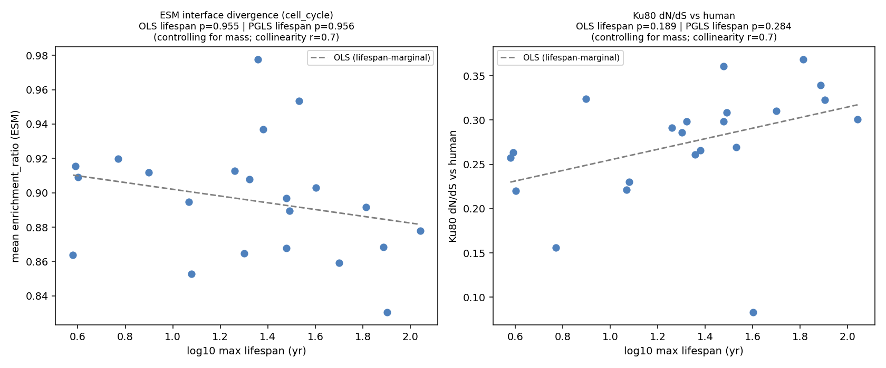

# Phylogeny-aware continuous reanalysis — does divergence scale with lifespan, not body mass?

Date: 2026-07-29
Status: **methodological rigor check — not a validated biological claim.**
Motivated by a design critique of the binary ELLSM/BMAL/Reference contrasts: (1) related
species (mole-rats, bats, whales) are not independent samples; (2) body mass and lifespan are
correlated and confounded; (3) a group-mean Mann-Whitney is low-powered. This run replaces the
binary contrast with a **continuous, phylogeny-aware regression**.

## Method

Per-species molecular divergence is regressed on **log10 maximum lifespan and log10 adult body mass
jointly**, with and without phylogenetic correction:

- **OLS** multiple regression (species treated as independent).
- **PGLS** — GLS with a Brownian-motion phylogenetic variance–covariance matrix built from an
  approximate mammalian timetree (down-weights close relatives).

Two response variables, 22 species:

- **A. ESM interface divergence** = per-species mean `enrichment_ratio` over the cell_cycle panel
  (`data/output/enrichment.parquet`).
- **B. Selection (dN/dS)** = per-species pairwise Nei–Gojobori ω vs human on Ku80
  (`data/interim/ku80/ku80_codon_alignment.fasta`).

Trait values are literature maxima (AnAge / PanTHERIA-consistent); the tree is an approximate
TimeTree topology with rounded divergence times — adequate for down-weighting close relatives in an
exploratory PGLS, not a formally dated tree.

## Results — no lifespan signal survives; the one hint dissolves under the correct model

| Response | raw r vs log-lifespan | OLS lifespan p (\|mass) | PGLS lifespan p (\|mass) | mass effect |
|---|---:|---:|---:|---|
| **A. ESM interface divergence** | −0.25 (p=0.27) | b=−0.001, **p=0.96** | b=−0.001, **p=0.96** | weakly negative, ns |
| **B. Ku80 dN/dS vs human** | +0.40 (**p=0.066**) | b=+0.026, **p=0.19** | b=+0.023, **p=0.28** | ~0, ns |

Predictor collinearity: r(log-lifespan, log-mass) = **0.70** (n = 22).

Three readings:

1. **The embedding metric trends the *wrong* way and is null.** ESM interface divergence is, if
   anything, *lower* in longer-lived and larger species (raw r = −0.25 / −0.34) — i.e. more
   conserved, the opposite of the divergence prediction — and the lifespan coefficient is
   flat (p = 0.96) once mass and phylogeny are in the model. The weak trend is a **mass** effect,
   not a lifespan effect.

2. **The single hint of the whole series does not hold up.** Ku80 dN/dS correlates positively with
   lifespan at the raw level (r = +0.40, p = 0.066) — the only nominal longevity association we have
   seen. But controlling for body mass drops it to p = 0.19, and adding phylogenetic correction
   drops it to **p = 0.28**. It was partly a mass/relatedness confound, not a lifespan signal.

3. **The upgrade the critique asked for does not rescue a positive.** A continuous,
   mass-controlled, phylogeny-aware design — exactly the more rigorous procedure — still finds no
   longevity association on either metric. Phylogenetic correction here *reduces* an apparent signal
   rather than revealing one, which is the expected direction when related species were inflating an
   effect.

## Interpretation

The negatives from the binary stratified contrasts are not an artifact of the binary design or of
treating species as independent: a continuous PGLS that dissociates body mass from lifespan and
accounts for relatedness reaches the same conclusion. It also clarifies *why* the binary
BMAL-vs-Reference direction was inverted — the mild "more conserved" trend tracks **body mass**, not
longevity. This tightens the method-boundary statement rather than overturning it.

## Caveats / boundaries

- **Power.** n = 22 with predictor collinearity r = 0.70 limits the ability to fully separate
  lifespan from mass; neither reaches significance, so we cannot claim a lifespan effect is *absent*,
  only that none is detected and the one raw hint does not survive the correct model.
- **Approximate inputs.** Trait maxima and the timetree are literature/approximate; a formally dated
  tree and curated AnAge pull would sharpen the PGLS but are unlikely to move a p = 0.28 result.
- **Response B is one gene** (Ku80) and pairwise-vs-human ω folds in divergence-time differences; a
  branch-model (codeml/HyPhy) across more genes would be the confirmatory step — but the raw signal
  already fails the mass+phylogeny control.
- **Level.** As noted in the companion runs, coding-interface divergence may be the wrong molecular
  level for longevity/cancer-resistance biology (dosage/regulatory mechanisms — elephant TP53,
  NMR hyaluronan — are the project's actual leads).

## Provenance

`scripts/analyze_phylo_continuous.py` → `phylo_continuous.json`, `phylo_continuous.png` (committed
here). Inputs: `data/output/enrichment.parquet` (cell_cycle), `data/interim/ku80/ku80_codon_alignment.fasta`.
