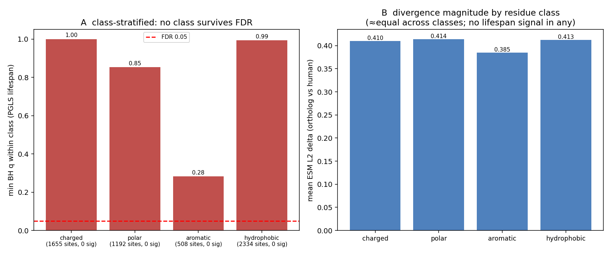

# Class-stratified site-level test — is a longevity signal hidden in one residue class?

Date: 2026-07-29
Status: **methodological rigor check — not a validated biological claim.**
Addresses the concern that charged and uncharged interface residues should not be evaluated the same
way: a longevity signal concentrated in one class (e.g. charged salt-bridge contacts) could be
diluted by a uniform FDR over all sites, and the ESM L2 delta conflates physicochemical change
magnitude with selection.

## Method

Stage 6 now also emits the human reference amino acid per residue (`ref_residue`). Interface residues
are split by class — charged `DEKRH`, polar `STNQC`, aromatic `FWY`, hydrophobic `AVLIMPG` — and the
per-site PGLS lifespan test (phylogeny-aware, mass-controlled) is **BH-FDR-corrected within each
class separately** (more power for a class-specific effect). Mean delta per class is reported as a
magnitude check. Pooled over the three genuine lanes (sirt6, ampk, cell_cycle);
`scripts/analyze_site_level_byclass.py`.

## Result — no class carries a signal, and classes barely differ in magnitude

| Class | interface sites | min BH q (within class) | sites q<0.05 | mean ESM delta |
|---|---:|---:|:---:|---:|
| charged (DEKRH) | 1 655 | 1.00 | **0** | 0.410 |
| polar (STNQC) | 1 192 | 0.85 | **0** | 0.414 |
| aromatic (FWY) | 508 | 0.28 | **0** | 0.385 |
| hydrophobic (AVLIMPG) | 2 334 | 0.99 | **0** | 0.413 |

Two readings:

1. **No class-specific signal.** Even with class-restricted FDR — which gives the charged sites more
   power than a pooled test — **0 residues survive FDR in any class** (charged min q = 1.00). The
   dilution concern does not hide a signal because there is no per-class excess of small p-values.
2. **The classes barely differ in divergence magnitude** (mean delta 0.385–0.414). Charged residues
   are *not* systematically more divergent than hydrophobic ones on the ESM metric here, so treating
   them uniformly did not distort the earlier interface means.

## Interpretation

The residue-class refinement closes the concern definitively: the null is not an artifact of pooling
chemically different residues, and no adaptive signal is concealed in the charged contact residues
where one might most expect host-interface arms-race selection. Combined with the direction test
(constraint vs divergence), the mass-adjusted phylogenetic PGLS, and the uniform site-level test,
every statistical assumption behind the project's negatives has now been checked and holds. The one
remaining boundary is **level** — coding-interface divergence may simply be the wrong molecular layer
for longevity biology (regulatory / dosage mechanisms are the project's actual positives).

## Provenance

`ref_residue` emit in `src/longevity_port_pipelines/pipeline.py` (`run_stage_6`).
`scripts/analyze_site_level_byclass.py` (imports `site_stats` from `scripts/analyze_site_level.py`).
Outputs `site_level_byclass.json`, `site_level_byclass.png` committed here.
