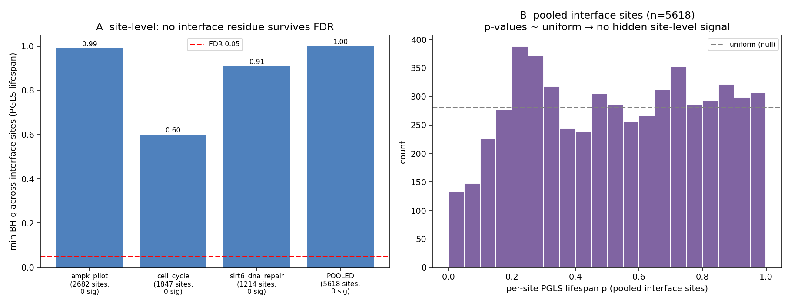

# Site-level longevity test — does any single interface residue carry a signal the mean hides?

Date: 2026-07-29
Status: **methodological rigor check — not a validated biological claim.**
Addresses the design critique that an interface *mean* could mask a few adaptive residues (positive
selection is typically 2–3 sites, not a whole interface).

## Method

Stage 6 was extended to emit per-residue ESM L2 deltas (ortholog vs human) alongside the interface
means (`residue_deltas.parquet`; `run_stage_6` in `pipeline.py`). Regenerated Biohub-free from cache
for the three genuine lanes (sirt6, ampk, cell_cycle). For every **interface residue** (unique
complex × chain × reference-position) the per-species delta vector is tested against lifespan three
ways — **PGLS lifespan coefficient** (phylogeny-aware, controls body mass; primary), Spearman(delta,
lifespan), Mann-Whitney long-lived (10) vs reference (12) — with **BH-FDR across all interface
sites** (`scripts/analyze_site_level.py`). Non-interface residues are carried as a background control.

## Result — no interface residue survives FDR, anywhere

| Lane | interface sites | min PGLS q | sites q<0.05 | median per-site p |
|---|---:|---:|:---:|---:|
| sirt6_dna_repair | 1 214 | 0.91 | **0** | 0.49 |
| ampk_pilot | 2 682 | 0.99 | **0** | 0.53 |
| cell_cycle | 1 847 | 0.60 | **0** | 0.57 |
| **POOLED** | **5 618** | **1.00** | **0** | 0.53 |

Across **5 618 interface residues**, not one is associated with lifespan after phylogeny + mass
control and multiple-testing correction. The per-site p-value distribution is **uniform** (median
≈ 0.5; if anything a slight *deficit* of small p-values, the opposite of hidden signal).

## Interpretation

The interface-mean was not masking site-level adaptation: at single-residue resolution — the level
where positive selection actually acts — there is still no longevity signal, on any of the three
genuine lanes or pooled. This closes the last of the three untested definitional assumptions behind
the project's negatives:

1. **Direction** (divergence vs constraint) — long-lived species are neither significantly more
   diverged nor more conserved at interfaces (binomial p = 0.21, Wilcoxon p = 0.36).
2. **Phenotype axis / independence** — mass-adjusted, phylogeny-aware continuous PGLS is null across
   52 interfaces (p = 0.73).
3. **Mean vs sites** — 0 / 5 618 interface residues survive FDR (this run).

The remaining untested assumption is **level**: coding-interface divergence may be the wrong
molecular level for longevity biology (regulatory / dosage — elephant TP53, NMR hyaluronan — are the
project's actual positives). That is a scope boundary of the ESM interface method, not something a
regrouping or a finer statistic can fix.

## Caveats

Technical checkpoint, not a validated claim. Per-site power is limited (≤ 22 species, fewer where
alignment gaps drop a species; MIN_SPECIES = 14), but across thousands of sites BH-FDR would surface
any concentrated signal and none appears. Genuine lanes only (sirt6, ampk, cell_cycle); trait maxima
and timetree are approximate.

## Provenance

Per-residue emit: `src/longevity_port_pipelines/pipeline.py` (`run_stage_6`) →
`data/output/residue_deltas.parquet` (gitignored, per-lane copies under `data/interim/residues/`).
Analysis: `scripts/analyze_site_level.py` (imports the PGLS engine from
`scripts/analyze_phylo_continuous.py`). Outputs `site_level.json`, `site_level.png` committed here.
